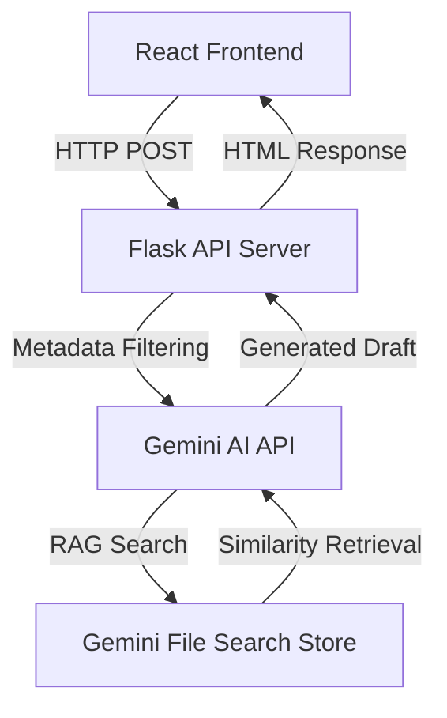

# 🤖 도큐메딕스 (Documedix)

> **AI 기반 의료기기 인허가 문서 자동 생성 및 RAG 검색 시스템**
> 본 프로젝트는 복잡한 의료기기 제조 허가 신청서 작성 과정을 자동화하기 위해, 15만 건의 승인 문서 데이터를 기반으로 한 **RAG(Retrieval-Augmented Generation)** 솔루션입니다.

---

## 📺 Demo & Preview


---

## 🚀 주요 기능

* **AI 초안 자동 생성**: 15만 건의 전문 문서를 참조하여 작용원리, 외형, 성능 등 9개 카테고리의 문서 초안을 생성합니다.
* **RAG 기반 정밀 검색**: Gemini File Search Store를 활용하여 사용자 입력과 가장 유사한 과거 승인 데이터를 실시간으로 참조합니다.
* **WYSIWYG 웹 에디터**: CKEditor 5를 활용하여 AI가 생성한 초안을 즉시 수정하고 DOCX/PDF로 내보낼 수 있는 환경을 제공합니다.
* **품목별 맞춤형 필터링**: 2,269개 의료기기 품목 및 1~4등급 분류 체계를 적용하여 데이터 정확도를 극대화했습니다.

---

## 🏗️ 시스템 아키텍처



---

## 🛠 기술 스택

### Frontend

* **Core**: React 18.3.1, React Router DOM 6.25.1
* **UI/UX**: CKEditor 5 (11.0.0), Tailwind CSS 3.4.5, Lucide React
* **Document**: docx 9.5.1, html-docx-js 0.3.1

### Backend & AI

* **Framework**: Flask 3.0.0, Flask-CORS 4.0.0
* **AI Model**: Google Generative AI (Gemini 2.5 Flash) 1.52.0
* **Database**: Gemini File Search Store (Serverless Vector DB)

### Data Processing

* **Parsing**: pdfplumber 0.11.8, pypdfium2 5.0.0, pandas

---

## 🔥 트러블슈팅 및 인사이트

### 1. CUDA 충돌 이슈와 아키텍처 전환

* **문제**: 신규 GPU(RTX 5080) 환경 도입 시 로컬 인프라의 CUDA 버전 충돌로 인해 벡터 DB 및 로컬 RAG 서버 구축이 지연되는 상황 발생.
* **해결**: 인프라 문제 해결에 시간을 허비하기보다 비즈니스 적기 배포를 위해 **Gemini File Search Store(서버리스 RAG)** 기능을 신속히 채택하여 아키텍처를 전환.
* **결과**: 인프라 제약을 우회하여 프로젝트 일정을 준수했으며, 오히려 서버 관리 비용을 절감하고 확장성을 확보함.

### 2. 환각(Hallucination) 문제 해결

* **문제**: 15만 건의 방대한 데이터 조회 시 타 등급이나 무관한 품목의 데이터가 섞여 답변의 정확도가 떨어지는 현상 발생.
* **해결**: 메타데이터에 **의료기기 등급(1~4등급) 및 품목코드**를 명시하고, 검색 시 작성 중인 문서의 속성과 일치하는 데이터만 조회하도록 **메타데이터 필터링** 로직을 강화.
* **결과**: 관련 없는 데이터의 간섭을 차단하여 초안의 정확성을 크게 높였으며, AI에게 "데이터가 없을 경우 허구 내용을 지어내지 말 것"을 명시적으로 지시하여 데이터 무결성을 확보함.

---

## 📂 프로젝트 구조

```bash
src/
├── App.js                          # 메인 앱 로직
├── docuApp.jsx                     # 문서 작성/편집 컴포넌트
└── components/
    └── TextEditor.jsx              # CKEditor 커스텀 래퍼
upload/
├── api_server.py                   # Flask API 서버 및 RAG 로직
├── generate_draft.py               # AI 초안 생성 모듈
└── find_similar_documents.py       # 유사 문서 검색 엔진

```
